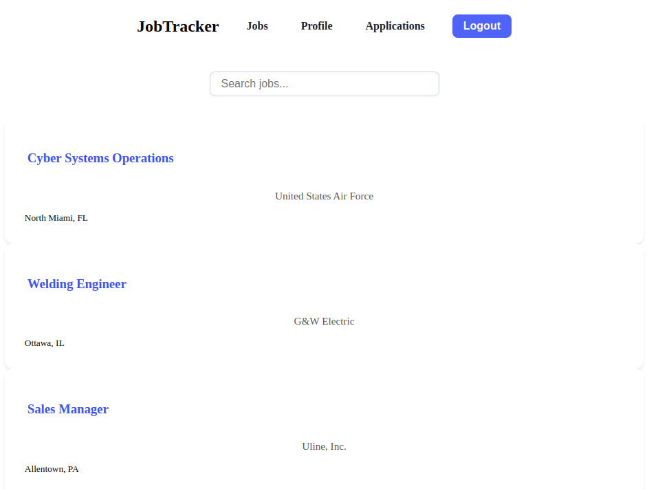

# Job Tracker App

A simple React web application for tracking job applications.  
Built as a Phase 2 project at **Moringa School** to demonstrate understanding of React fundamentals, controlled components, context, routing, and interaction with a mock backend (**JSON Server**).

---

## Table of Contents
- [Overview](#overview)
- [Features](#features)
- [Technologies Used](#technologies-used)
- [Installation and Setup](#installation-and-setup)
- [Available Scripts](#available-scripts)
- [Folder Structure](#folder-structure)
- [Screenshots](#screenshots)
- [Future Improvements](#future-improvements)
- [Contributors](#contributors)

---

## Overview

Job Tracker App helps users organize and track their job applications.  
Users can:
- Add records of jobs they have applied to
- View application history
- Filter and search applications
- Edit personal profile details
- Contact site administrators via a form

User sessions are managed with **React Context** and **Session Storage**, and data persistence is simulated using **JSON Server**.

---

## Features

- User registration and login
- Protected routes (login required for dashboard)
- Add new job applications (title, company, date, status, notes)
- View application history
- Filter/search by job title, company, or status
- Edit user profile
- Upload resume or related documents
- Contact page for inquiries or support

---

## Technologies Used

- **Vite** + **React** (Fast development server)
- **React Router DOM** (Routing & Protected Routes)
- **React Context API** (Authentication state management)
- **JSON Server** (Mock backend for REST API simulation)
- **Fetch API** (HTTP requests)
- **Session Storage** (Simple session persistence)

---

## Installation and Setup

1. Clone the repository:
   ```bash
   git clone git@github.com:Frank-incense/jobTrackerApp.git
   cd job-tracker-app
   ```

2. Install dependencies:
   ```bash
   npm install
   ```

3. Set up JSON Server:
   - Create a `db.json` file with collections for `users`, `applications`, etc.
   - Start JSON Server:
     ```bash
     npx json-server --watch db.json --port 8000
     ```

4. Start the Vite development server:
   ```bash
   npm run dev
   ```

The app should now be running at [http://localhost:5173](http://localhost:5173) (or as Vite displays in your terminal).

---

## Available Scripts

| Command | Description |
| :------ | :----------- |
| `npm run dev` | Runs the app in development mode (Vite server) |
| `npm run build` | Builds the app for production |
| `npm run preview` | Previews the production build locally |
| `npx json-server --watch db.json --port 8000` | Starts the mock backend server |

---

## Folder Structure

```
src/
├── assets/               # Static assets (images, icons, etc.)
├── components/           # Reusable components (Navigation, Routing, Context)
│   ├── AuthContextProvider.jsx
│   ├── Job.jsx
│   ├── NavBar.jsx
│   ├── ProtectedRoutes.jsx
│   └── routes.jsx
├── pages/                # Pages and major sections
│   ├── AppTracker/
│   │   ├── Applications.jsx
│   │   ├── ApplyForm.jsx
│   │   └── ApplyForm.css
│   ├── JobBoard/
│   │   ├── JobBoard.jsx
│   │   ├── JobCard.jsx
│   │   ├── JobCard.css
│   │   ├── JobListing.jsx
│   │   ├── SearchBar.jsx
│   │   └── SearchBar.css
│   ├── Applications.jsx
│   ├── Applications.css
│   ├── Contact.jsx
│   ├── ErrorPage.jsx
│   ├── Home.jsx
│   ├── Home.css
│   ├── Login.jsx
│   ├── Login.css
│   ├── ProfilePage.jsx
│   ├── Register.jsx
│   └── UserProfile.jsx
├── App.jsx                # Root component
├── index.css              # Global styles
├── main.jsx               # Entry point

```

---

## Screenshots




---

## Future Improvements

- Password encryption for better security (even on mock backend)
- Notifications or alerts for application status changes
- Pagination for large application history
- Ability to upload real files and view them
- Role-based access (e.g., admin dashboard)

---

## Contributors

- [Edel Omondi](https://github.com/EDEL-WEB)
- [Cynthia Abuya](https://github.com/Zayelle)
- [George Mwanzuna](https://github.com/George-Dev-Web)
- [George Munene](https://github.com/AlghaniHasbulla)
- [Frankincense Okwemba](https://github.com/Frank-incense)

---
